# 智慧社区物业管理系统

## 项目概述

完整的智慧社区物业管理系统，采用单体 Spring Boot 后端 + 三端前端架构：

- **后端**：Spring Boot 2.7 + MyBatis Plus + MySQL 8.0
- **管理端（web-admin）**：Vue 3 + Element Plus，管理员和维修员使用，PC 端
- **业主 Web 端（web-user）**：Vue 3 + Vant，业主使用，仅做 PC 适配
- **微信小程序（miniprogram-owner）**：原生微信小程序，包含业主端和维修员端（通过登录角色切换）

三端共享同一套 REST API，通过 JWT Token 实现身份认证和角色权限控制。

## 环境要求

| 环境 | 版本要求 | 说明 |
|------|----------|------|
| JDK | 8 或以上 | 推荐 JDK 8 / 11 / 17 |
| Node.js | 16 或以上 | 推荐 LTS 版本 |
| MySQL | 8.0 或以上 | 需支持 JSON 类型 |
| Maven | 3.6 或以上 | 后端构建工具 |
| 微信开发者工具 | 最新稳定版 | 小程序开发调试 |

## 界面截图

### 管理端（web-admin）

| 功能 | 截图 |
|------|------|
| 登录页 | 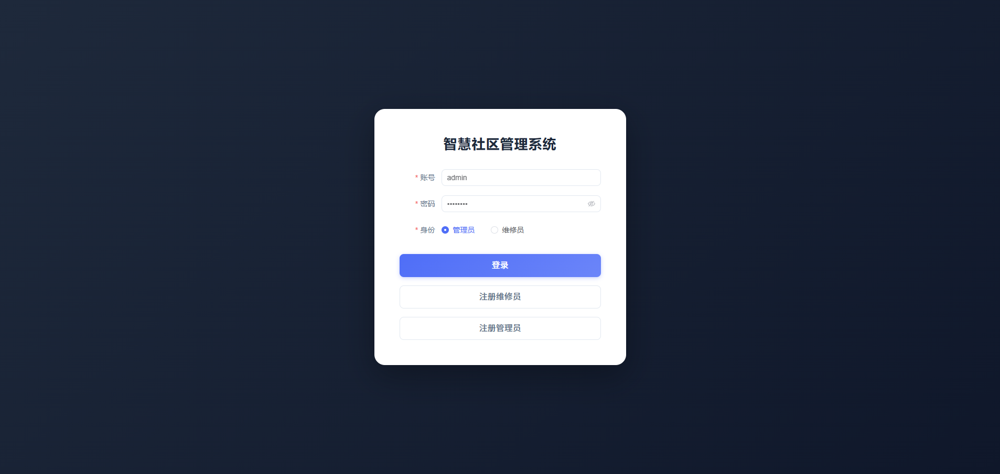 |
| 数据看板 | 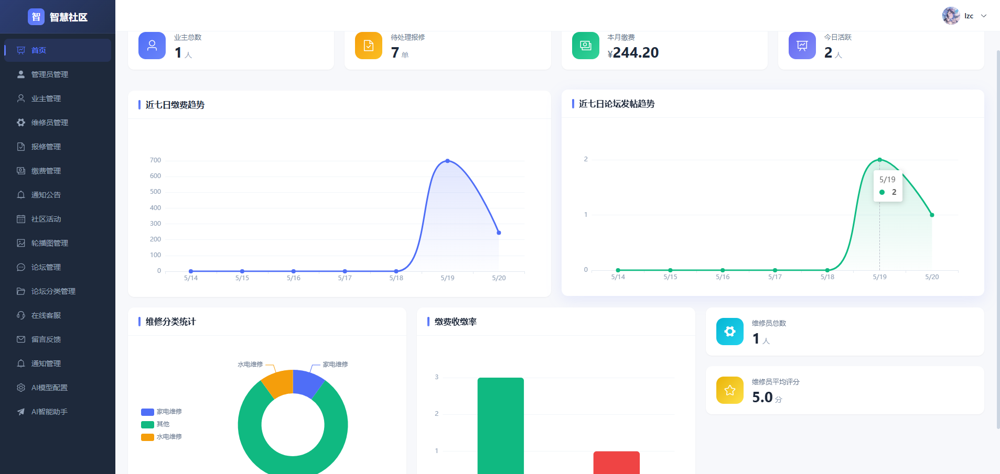 |
| 报修管理 | 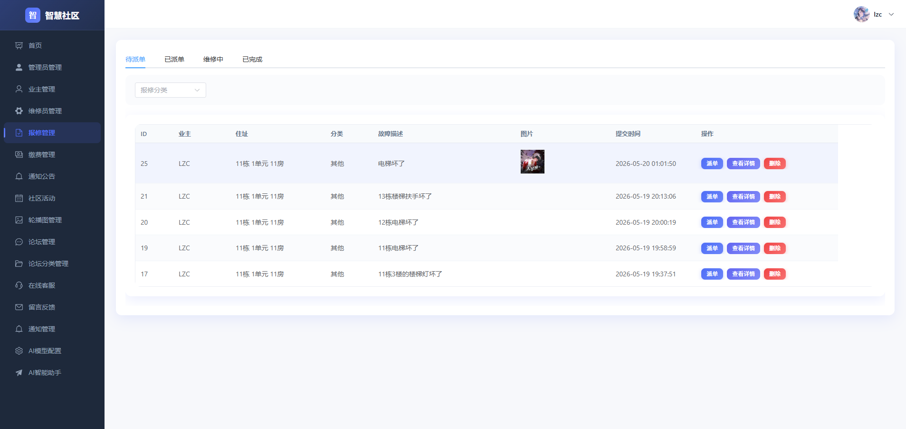 |
| AI 智能助手 | 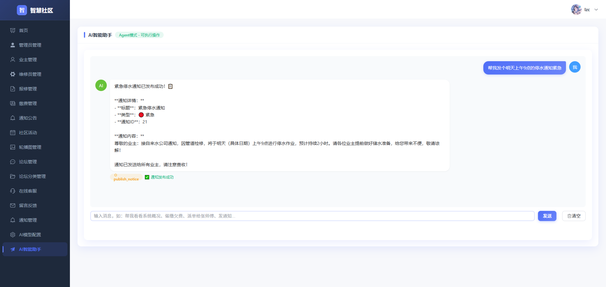 |

### 业主 Web 端（web-user）

| 功能 | 截图 |
|------|------|
| 首页 | 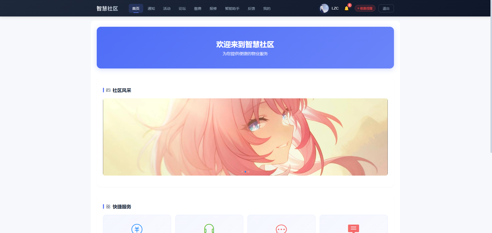 |
| 社区论坛 | 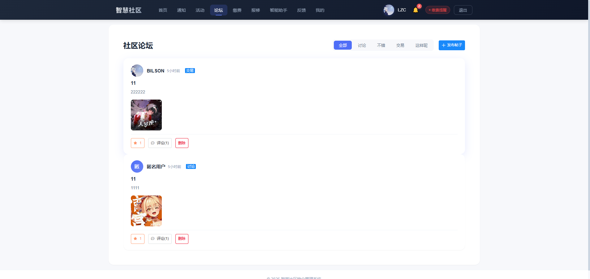 |
| 物业缴费 | 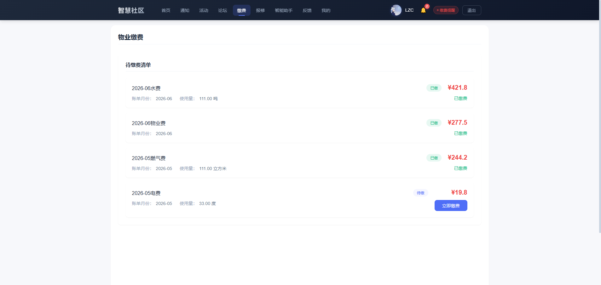 |
| AI 智能助手 | 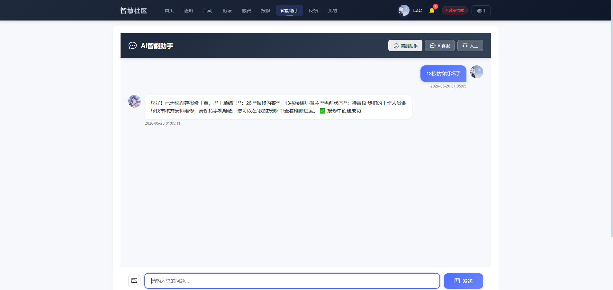 |

### 微信小程序（miniprogram-owner）

| 功能 | 截图 |
|------|------|
| 首页 | 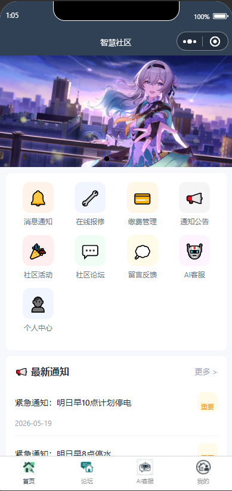 |
| 论坛 | 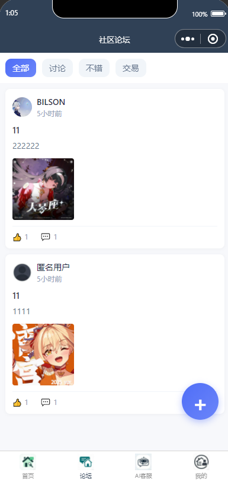 |
| 报修 | 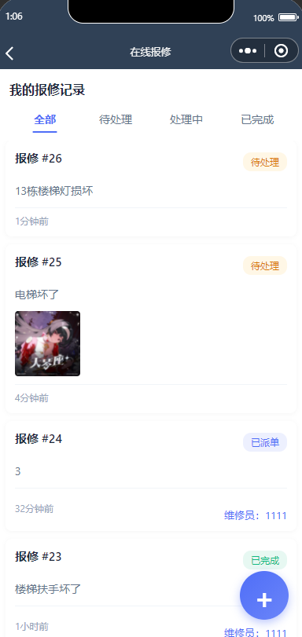 |
| 个人中心 | 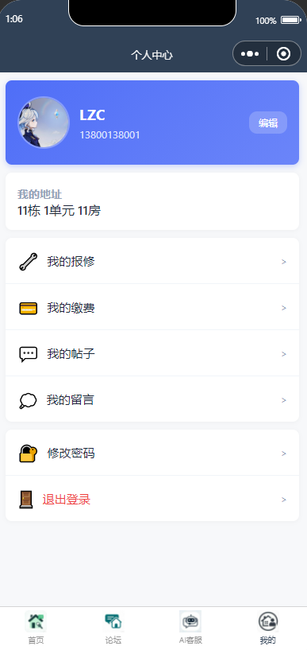 |

## 系统功能

### 管理员功能（web-admin）
- 首页数据概览（业主数、报修统计、缴费收缴率、维修员评分、趋势图表）
- 业主管理（增删改查）
- 维修员管理（审核、禁用、绩效统计）
- 报修管理（审核、派单、按分类筛选）
- 缴费管理（新增、批量新增、一键催缴、费用单价设置）
- 通知公告发布（已读追踪）
- 社区活动管理（报名管理）
- 轮播图管理
- 论坛管理（内容审核：通过/拒绝）
- 论坛分类管理
- 在线客服（人工回复）
- 留言反馈管理
- AI 模型配置
- AI 智能助手（Agent 模式，可执行操作）
- 通知管理（推送通知查看）

### 维修员功能（web-admin / 小程序）
- 工单大厅（待处理 / 进行中 / 已完成）
- 开始维修 / 完成维修 / 退单
- 已完成订单查看
- 个人中心
- 绩效统计（完成数、平均评分、平均耗时）

### 业主功能（web-user / 小程序）
- 首页浏览（轮播图、通知公告、活动推荐、未读通知提醒）
- 物业缴费（查看账单、在线支付、待缴费汇总）
- 在线报修（提交故障、上传图片、选择分类）
- AI 智能助手（Agent 模式，可执行报修、查费、评价等操作）
- AI 客服（RAG 模式，基于上下文问答）
- 人工客服（实时聊天）
- 社区论坛（发帖、评论、点赞，帖子需审核）
- 社区活动（查看详情、报名/取消报名）
- 通知公告（已读追踪、未读标记）
- 留言反馈
- 通知中心（推送通知、标记已读）
- 个人中心（楼栋/单元/房间信息、待缴费汇总）

## 技术栈

### 后端
| 技术 | 版本 | 说明 |
|------|------|------|
| Spring Boot | 2.7.14 | 应用框架 |
| MyBatis Plus | 3.5.3.1 | ORM 框架 |
| MySQL | 8.0 | 数据库 |
| JWT (jjwt) | 0.9.1 | 身份认证 |
| Hutool | 5.8.16 | 工具库 |
| Lombok | - | 代码简化 |
| Spring AOP | - | 角色权限切面 |

### 管理端（web-admin）
| 技术 | 版本 | 说明 |
|------|------|------|
| Vue | 3.3.4 | 前端框架 |
| Element Plus | 2.3.14 | UI 组件库 |
| Vue Router | 4.2.4 | 路由管理 |
| Pinia | 2.1.6 | 状态管理 |
| Axios | 1.5.0 | HTTP 请求 |
| ECharts | 5.4.3 | 图表可视化 |
| Vite | 4.4.9 | 构建工具 |

### 业主 Web 端（web-user）
| 技术 | 版本 | 说明 |
|------|------|------|
| Vue | 3.3.4 | 前端框架 |
| Vant | 4.7.1 | 移动端 UI 组件库 |
| Vue Router | 4.2.4 | 路由管理 |
| Axios | 1.5.0 | HTTP 请求 |
| Vite | 4.4.9 | 构建工具 |

### 微信小程序（miniprogram-owner）
- 原生微信小程序开发
- 21 个页面，底部 4 个 Tab（首页、论坛、AI客服、我的）
- 业主和维修员共用同一小程序，通过登录角色切换界面

## 项目结构

```
elysia1/
├── screenshots/                 # 界面截图（README 引用）
├── database/                    # 数据库脚本
│   └── wuye.sql                 # 建库建表 + 种子数据
├── backend/                     # Spring Boot 后端
│   ├── src/main/java/com/wye/
│   │   ├── agent/               # AI Agent 系统（PropertyAgent, AgentController, PropertyAgentTools）
│   │   ├── aspect/              # AOP 切面（RoleAspect 角色权限校验）
│   │   ├── common/              # 通用类（Result, RequireRole 注解）
│   │   ├── config/              # 配置类（CORS, 静态资源, 拦截器注册）
│   │   ├── controller/          # REST 控制器（14 个）
│   │   ├── dto/                 # 数据传输对象
│   │   ├── entity/              # 实体类（20 个）
│   │   ├── interceptor/         # JWT 认证拦截器
│   │   ├── mapper/              # MyBatis Plus Mapper 接口
│   │   ├── service/             # 业务逻辑层
│   │   └── util/                # 工具类（JWT）
│   ├── src/main/resources/
│   │   └── application.yml      # 应用配置
│   └── pom.xml                  # Maven 依赖
├── web-admin/                   # 管理端（Vue3 + Element Plus）
│   ├── src/
│   │   ├── layout/              # 布局组件
│   │   ├── router/              # 路由配置
│   │   ├── utils/               # 工具（request.js Axios 封装）
│   │   └── views/               # 页面组件（21 个）
│   ├── package.json
│   └── vite.config.js
├── web-user/                    # 业主 Web 端（Vue3 + Vant）
│   ├── src/
│   │   ├── layout/              # 布局组件
│   │   ├── router/              # 路由配置
│   │   ├── utils/               # 工具
│   │   └── views/               # 页面组件（15 个）
│   ├── package.json
│   └── vite.config.js
└── miniprogram-owner/           # 微信小程序
    ├── pages/                   # 页面目录（21 个）
    ├── utils/                   # 工具（request.js, api.js）
    ├── images/                  # 静态图片资源
    ├── app.js                   # 小程序入口
    ├── app.json                 # 页面注册和 Tab 配置
    └── app.wxss                 # 全局样式
```

## 快速开始

### 1. 数据库初始化

```bash
mysql -u root -p < database/wuye.sql
```

默认数据库名 `wuye`，用户名 `root`，密码 `12345678`。

### 2. 启动后端

```bash
cd backend

# 开发模式启动
mvn spring-boot:run

# 或打包后运行
mvn clean package -DskipTests
java -jar target/wuye-system-1.0.0.jar
```

后端运行在 http://localhost:8080/api

### 3. 启动管理端

```bash
cd web-admin
npm install
npm run dev
```

管理端运行在 http://localhost:3000

### 4. 启动业主 Web 端

```bash
cd web-user
npm install
npm run dev
```

业主 Web 端运行在 http://localhost:3001

### 5. 微信小程序

使用微信开发者工具导入 `miniprogram-owner/` 目录，点击编译运行。需要在 `miniprogram-owner/app.js` 中配置 `baseURL` 指向后端地址。

### 默认账号

| 角色 | 账号 | 密码 |
|------|------|------|
| 管理员 | admin | 12345678 |
| 业主 | 需注册 | - |
| 维修员 | 需注册（需管理员审核） | - |

## AI 系统

系统提供两种 AI 交互模式：

### AI 客服（RAG 模式）
- 从数据库检索用户相关信息（欠费、通知、报修等）
- 将检索结果作为上下文构造 Prompt
- 调用 AI 接口生成回复
- 支持图片识别（上传图片 + 文字提问）

### AI Agent（Function Calling 模式）
- 基于 OpenAI 兼容的 Function Calling 协议
- 最多 5 轮工具调用循环
- 31 个内置工具，按角色过滤：
  - **业主工具（19 个）**：查询欠费、查收费标准、查缴费历史、创建报修、查报修进度、撤回报修、查通知、查业主信息、评价维修、查活动、报名活动、取消报名、查我的活动、提交反馈、发论坛帖、搜索论坛、查我的帖子、查通知、标记已读
  - **管理员工具（12 个）**：派单、查可用维修员、查报修列表、查维修员绩效、查仪表盘统计、查账单列表、创建账单、批量生成账单、一键催缴、发布通知、查反馈列表、处理反馈
- 根据用户角色自动过滤可用工具，业主无法调用管理员工具
- 支持多 AI 提供商（本地模型、ModelScope、DashScope 等），配置存储在 `ai_config` 表

## 角色权限

系统通过自定义 `@RequireRole` 注解 + AOP 切面实现角色权限控制：

| 角色 | 值 | 说明 |
|------|----|------|
| 管理员 | 0 | 全部管理功能 |
| 业主 | 1 | 缴费、报修、论坛、客服等 |
| 维修员 | 2 | 工单处理、维修操作 |

JWT Token 中包含 userId、username、role，拦截器解析后存入 request attribute，AOP 切面在方法执行前校验角色。

## 数据库设计

系统包含 20 张表：

**用户相关**
| 表名 | 说明 |
|------|------|
| sys_user | 系统用户（管理员/业主/维修员） |
| sys_owner | 业主扩展信息（楼栋、单元、房间、身份证） |
| sys_repair_worker | 维修员扩展信息（审核状态） |
| sys_notification | 推送通知（按用户、已读状态） |

**业务相关**
| 表名 | 说明 |
|------|------|
| bus_carousel | 轮播图 |
| bus_notice | 通知公告 |
| bus_notice_read | 公告已读追踪 |
| bus_activity | 社区活动 |
| bus_activity_signup | 活动报名 |
| bus_fee | 缴费记录 |
| bus_fee_settings | 费用单价配置 |
| bus_repair | 报修工单（含分类字段） |
| bus_evaluation | 维修评价（1-5 分） |
| bus_feedback | 留言反馈 |

**论坛相关**
| 表名 | 说明 |
|------|------|
| bus_forum | 论坛帖子（含审核状态） |
| bus_forum_category | 论坛分类 |
| bus_forum_comment | 帖子评论 |
| bus_forum_like | 帖子点赞 |

**系统相关**
| 表名 | 说明 |
|------|------|
| chat_record | 聊天记录 |
| ai_config | AI 模型配置 |

## 部署

### 后端部署

1. 修改 `backend/src/main/resources/application.yml` 中的数据库连接、JWT 密钥、AI 配置
2. `mvn clean package -DskipTests`
3. `java -jar target/wuye-system-1.0.0.jar`

### 前端部署

```bash
# 管理端
cd web-admin && npm run build

# 业主 Web 端
cd web-user && npm run build
```

将 `dist` 目录部署到 Web 服务器。

### 小程序发布

使用微信开发者工具上传代码，提交微信审核。

### Nginx 配置示例

```nginx
server {
    listen 80;
    server_name your-domain.com;

    # 管理端
    location /admin {
        alias /path/to/web-admin/dist;
        try_files $uri $uri/ /admin/index.html;
    }

    # 业主 Web 端
    location / {
        alias /path/to/web-user/dist;
        try_files $uri $uri/ /index.html;
    }

    # 后端 API 代理
    location /api {
        proxy_pass http://localhost:8080;
        proxy_set_header Host $host;
        proxy_set_header X-Real-IP $remote_addr;
    }

    # 上传文件
    location /upload {
        alias /path/to/backend/upload;
    }
}
```

## 注意事项

1. 确保 MySQL 8.0 已启动，且数据库连接配置正确
2. 生产环境务必修改 JWT 密钥（`application.yml` 中的 `jwt.secret`）
3. 文件上传目录（`backend/upload/`）需要写权限
4. AI 功能需要配置 `ai_config` 表或在 `application.yml` 中配置默认 AI 服务地址
5. 小程序需要在 `app.js` 中配置正确的后端 `baseURL`
6. 微信小程序真机调试需要配置合法域名（小程序后台 → 开发管理 → 服务器域名）

## 许可证

本项目采用 [CC BY-NC-SA 4.0](https://creativecommons.org/licenses/by-nc-sa/4.0/)（知识共享署名-非商业性使用-相同方式共享 4.0 国际）许可证。

**您可以：**
- 共享 — 在任何媒介以任何形式复制、发行本作品
- 演绎 — 修改、转换或以本作品为基础进行创作

**惟须遵守下列条件：**
- 署名 — 您必须给出适当的署名
- 非商业性使用 — 您不得将本作品用于商业目的
- 相同方式共享 — 如果您修改本作品，必须以相同许可证分发

详见 [LICENSE](LICENSE) 文件。
